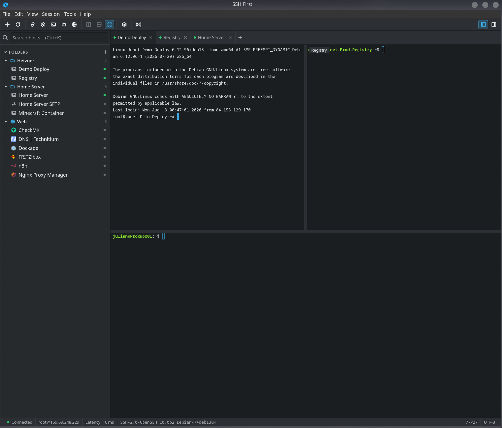
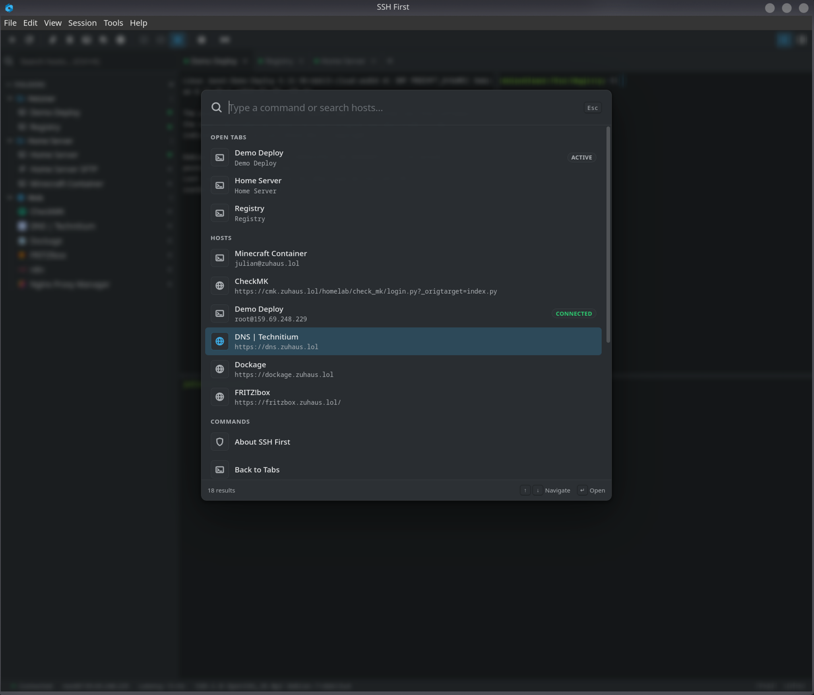
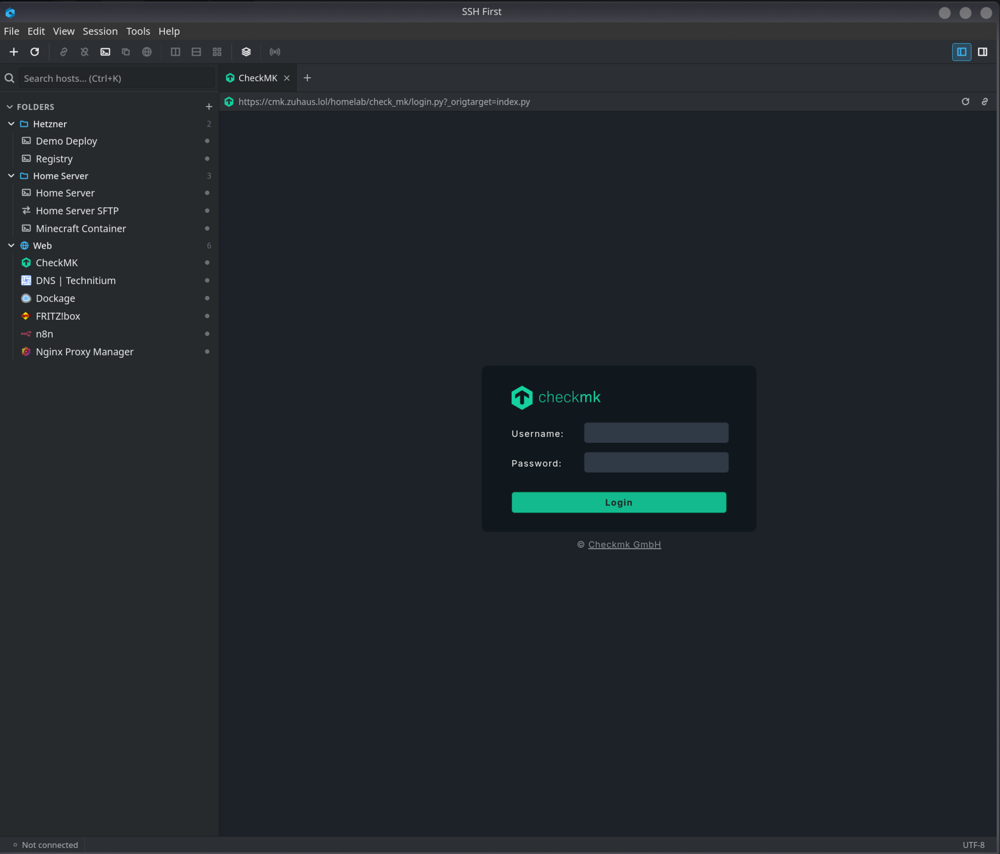

<div align="center">


# SSH First

**A fast, native SSH, SFTP and admin-panel workspace for Linux and macOS.**

All your servers in one window: terminals, file transfers, tunnels and web
control panels, side by side. Local-first, no account, no cloud.

<p>
  <a href="https://github.com/junet-1/sshfirst/actions/workflows/ci.yml"></a>
  <a href="https://github.com/junet-1/sshfirst/releases/latest"></a>
  
  
  
</p>

<a href="#installation">Installation</a> ·
<a href="#features">Features</a> ·
<a href="#getting-started">Getting started</a> ·
<a href="#keyboard-shortcuts">Shortcuts</a> ·
<a href="#security">Security</a>

<br>



</div>

---

## Why SSH First

Managing a handful of servers usually means a terminal here, a file manager
there, a browser tab for the router, and a sticky note for the ports. SSH First
puts all of it into one desktop application that feels like it belongs on your
system, not like a website in a window.

- **One window for everything.** SSH terminals, SFTP file browsing and web
  control panels (Proxmox, Portainer, Grafana, Nginx Proxy Manager, and others)
  as tabs next to each other.
- **Your existing setup just works.** SSH First reads your `~/.ssh/config`, so
  your hosts, aliases and jump hosts are there on first launch.
- **Local-first and private.** No account, no telemetry, no sync server.
  Everything lives on your machine.
- **Native, not a browser tab.** A real desktop app with a system menu, system
  tray support, light and dark theme following your desktop, and English and
  German interface languages.

## Features

### Connections

- Import from `~/.ssh/config`, or add hosts manually
- Organise hosts in folders and tags, with instant search
- Password, private key and keyboard-interactive login
- `ProxyJump` and jump-host chains
- Reusable credential sets shared across many hosts
- Automatic reconnect with a clear prompt when a link drops

### Terminals

- Real interactive SSH sessions, many tabs per connection
- Split panes to arrange terminals side by side or stacked
- Search inside the terminal output
- Broadcast input to all tabs at once, for fleet-wide commands
- Snippets: save commands you run often and fire them into a session with one click
- Per-session font size, and copy the equivalent `ssh` command any time

### Files and tunnels

- Built-in SFTP browser with uploads, downloads and drag-and-drop transfers
- SSH port forwarding: local (`-L`), remote (`-R`) and dynamic SOCKS5 (`-D`),
  defined per host and toggled per connection

### Web panels

- Open a server's admin panel as an embedded tab right next to its terminal
- Optional email/username and password autofill with automatic sign-in
- Loaded straight from your machine, with no proxy in between
- One click to fall back to your normal browser for panels that refuse embedding

### Workspaces

- Save a whole layout (which hosts, which terminals, which panels, in which
  split arrangement) and restore it later
- Stored as plain, human-readable JSON you can keep in a dotfiles repo or share
  with your team

### Comfort

- Command palette for every action (<kbd>Ctrl</kbd>+<kbd>Shift</kbd>+<kbd>P</kbd>)
- System tray: close the window, keep sessions alive, start into the tray on login
- Paste guard warns before pasting multi-line text into a live shell
- Desktop notifications for finished transfers and dropped connections
- Light, dark, or follow the system theme
- Interface in English and German

## A look inside

<table>
<tr>
<td width="50%" valign="top">

<p align="center"><sub><b>Command palette</b><br>One shortcut reaches every tab, host and action.</sub></p>
</td>
<td width="50%" valign="top">

<p align="center"><sub><b>Web panels</b><br>Admin interfaces open as tabs next to your terminals.</sub></p>
</td>
</tr>
</table>

## Installation

Grab the package for your distribution from the
[latest release](https://github.com/junet-1/sshfirst/releases/latest).

| System | Package | Install |
| --- | --- | --- |
| Debian, Ubuntu 24.04+ | `ssh-first_<version>_amd64.deb` | `sudo apt install ./ssh-first_<version>_amd64.deb` |
| Fedora, RHEL | `ssh-first-<version>-1.*.x86_64.rpm` | `sudo dnf install ./ssh-first-<version>-1.*.x86_64.rpm` |
| Any other distribution | `SSH_First-<version>-x86_64.flatpak` | `flatpak install --user ./SSH_First-<version>-x86_64.flatpak` |
| Any (manual) | `ssh-first-<version>-linux-x86_64.tar.gz` | unpack and run `./install.sh` |
| Arch, Manjaro | build from source, see below | `cd packaging && makepkg -si` |
| macOS 12+ | `SSH-First-<version>-macos-universal.dmg` | open and drag to Applications |

The `.deb`, `.rpm` and the plain tarball use the GTK 4 and WebKitGTK 6.0 that
your distribution already ships. The Flatpak brings its own, which makes it the
right choice on anything older or more exotic.

Every release is checksummed in `SHA256SUMS`.

### macOS

The disk image holds a universal build that runs on Apple Silicon and Intel.
Releases are not signed with an Apple Developer ID, so Gatekeeper blocks the
first launch: right-click SSH First in Applications and choose **Open** once,
then it starts normally from then on.

Passwords go into the login keychain, and SSH First's data lives in
`~/Library/Application Support/ssh-first`. `rsync` transfers use whichever
`rsync` is on your `PATH` — macOS ships an old one that only knows per-file
progress, so `brew install rsync` gives you nicer transfer reporting.

### Arch Linux and Manjaro

```bash
git clone https://github.com/junet-1/sshfirst.git
cd sshfirst/packaging
makepkg -si
```

That installs SSH First as a regular `pacman` package: it adds an entry to your
application menu, registers the taskbar icon, and starts the app in the system
tray on the next login. Launching from the menu opens the main window as usual.

Optional but recommended: `gnome-keyring` or `kwallet` for secure password
storage, and `rsync` for faster SFTP transfers. The `.deb` and `.rpm` pull these
in as recommended packages already.

### Updating

Install the newer package the same way you installed the current one. If a
development build is still running, close it once and start SSH First from the
application menu afterwards, so the taskbar picks up the installed entry.

## Getting started

1. **Launch SSH First** from your application menu.
2. **Your hosts appear automatically** if you have a `~/.ssh/config`. Otherwise
   press <kbd>Ctrl</kbd>+<kbd>N</kbd> to add one.
3. **Double-click a host** to open a terminal. The first connection asks you to
   confirm the server's host key. This is expected and only happens once per host.
4. **Add a second tab** with <kbd>Ctrl</kbd>+<kbd>T</kbd>, and open the file
   browser or a web panel from the host's context menu.
5. **Save the arrangement as a workspace** once you like it, and reopen it in one
   step tomorrow.

Passwords and passphrases you choose to save go into your desktop's keyring
(GNOME Keyring or KWallet), never into a file on disk.

## Keyboard shortcuts

| Shortcut | Action |
| --- | --- |
| <kbd>Ctrl</kbd>+<kbd>Shift</kbd>+<kbd>P</kbd> / <kbd>Ctrl</kbd>+<kbd>Shift</kbd>+<kbd>Space</kbd> | Command palette |
| <kbd>Ctrl</kbd>+<kbd>K</kbd> | Search hosts |
| <kbd>Ctrl</kbd>+<kbd>N</kbd> | New host |
| <kbd>Ctrl</kbd>+<kbd>T</kbd> | New tab |
| <kbd>Ctrl</kbd>+<kbd>W</kbd> | Close tab |
| <kbd>Ctrl</kbd>+<kbd>Shift</kbd>+<kbd>T</kbd> | Reopen closed tab |
| <kbd>Ctrl</kbd>+<kbd>Tab</kbd> | Next tab (<kbd>Shift</kbd> for previous) |
| <kbd>Ctrl</kbd>+<kbd>Shift</kbd>+<kbd>W</kbd> | Disconnect current connection |
| <kbd>Ctrl</kbd>+<kbd>Shift</kbd>+<kbd>F</kbd> | Search in terminal |
| <kbd>Ctrl</kbd>+<kbd>Shift</kbd>+<kbd>B</kbd> | Broadcast input to all tabs |
| <kbd>Ctrl</kbd>+<kbd>+</kbd> / <kbd>-</kbd> / <kbd>0</kbd> | Terminal font size |
| <kbd>Ctrl</kbd>+<kbd>,</kbd> | Settings |
| <kbd>F11</kbd> | Fullscreen |

## Security

- **Secrets stay in the keyring.** Passwords and private-key passphrases are
  never written to the database or to log files. They live only in the Linux
  Secret Service (GNOME Keyring or KWallet).
- **Web autofill is origin-scoped.** A saved web password is sent only to the
  exact origin configured for that web host and is kept separate from SSH
  passwords in the keyring.
- **Host key verification is mandatory.** Unknown keys need explicit
  confirmation, and a *changed* key is shown as a security warning rather than a
  routine prompt.
- **Your system SSH stays untouched.** SSH First keeps its own `known_hosts`
  file and reads `~/.ssh/config` read-only, so it cannot corrupt your regular
  SSH client's state.
- **No network calls of its own.** No accounts, no telemetry, no sync service.
  SSH First only talks to the servers you tell it to.

## Your data

Everything SSH First stores lives in one place:

```text
~/.local/share/ssh-first/     (or $XDG_DATA_HOME/ssh-first)
├── hosts, folders, tags, settings   (SQLite database)
├── workspaces                       (JSON files)
└── known_hosts                      (separate from ~/.ssh/known_hosts)
```

Back up that folder and you have backed up your setup. Passwords are not in it,
they are in your keyring.

## Building from source

<details>
<summary><b>Requirements, build and development workflow</b></summary>

### Requirements (Arch Linux)

```sh
sudo pacman -S go nodejs npm gtk4 webkitgtk-6.0 base-devel pkgconf
go install github.com/wailsapp/wails/v3/cmd/wails3@v3.0.0-alpha.97
```

Make sure `$(go env GOPATH)/bin` is on your `PATH` so the `wails3` binary is
found. The old `wails build` command belongs to Wails v2 and cannot build this
project.

### Release build

```sh
wails3 build
```

The binary is written to `build/bin/ssh-first`.

### macOS build

macOS links WKWebView and Objective-C through cgo, so a Mac is required — there
is no cross-compilation path from Linux.

```sh
xcode-select --install                  # Xcode command line tools
brew install go node go-task            # toolchain
task darwin:package                     # → build/bin/SSH First.app
```

`task darwin:build` produces the bare binary, `task darwin:build:universal` one
that carries both architectures, and `task darwin:dmg VERSION=x.y.z` a disk
image. The bundle is assembled by `packaging/darwin/bundle.sh`, which ad-hoc
signs it — enough to run locally on Apple Silicon. Passing a real identity
enables the hardened runtime, which is what notarisation needs:

```sh
SIGN_IDENTITY="Developer ID Application: …" task darwin:package VERSION=x.y.z
```

### Legacy GTK3 fallback

Wails v3 uses GTK4 and WebKitGTK 6.0 by default. On systems with only the
legacy GTK3 and WebKit 4.1 stack, install `gtk3 webkit2gtk-4.1` and build with:

```sh
wails3 build -tags gtk3
```

### Frontend development

```sh
cd frontend && npm run dev      # Vite hot reload
cd frontend && npm run check    # TypeScript strict + Svelte diagnostics
```

Native integration is verified with a normal `wails3 build` and the binary
under `build/bin/`.

### Tests

```sh
go test ./...
```

Covered: SSH config parsing (including `Include` and wildcard patterns), SQLite
storage CRUD, `ProxyJump` parsing, `known_hosts` persistence and replacement,
and Secret Service read/write/delete against `go-keyring`'s in-memory mock, so
tests never touch a real keyring.

### Cutting a release

Packages are built by [`.github/workflows/release.yml`](.github/workflows/release.yml).
Pushing a tag builds all formats and publishes them:

```sh
git tag v0.2.3
git push origin v0.2.3
```

To validate packaging changes without publishing anything, run the same
workflow from the Actions tab with `workflow_dispatch` and a version number.
It produces the identical artifacts and skips only the publish step.

The tag also becomes the version in the About dialog: `APP_VERSION` is passed
to Vite, which substitutes it for `__APP_VERSION__`. Local builds show
`0.0.0-dev`.

Every format is derived from one staging tree built by
[`packaging/stage-tree.sh`](packaging/stage-tree.sh), so the `.deb`, `.rpm`,
tarball and Flatpak cannot drift apart in what they install or where.

### Project layout

```text
ssh-first/
├── main.go              # Wails v3 entrypoint: app, native windows, menu, single-instance handling
├── Taskfile.yml         # Binding / frontend / Linux build pipeline
├── internal/
│   ├── app/             # Wails-bound App struct, native menu
│   ├── config/          # ~/.ssh/config parsing (Host/Include), read-only
│   ├── storage/         # SQLite (modernc.org/sqlite, CGO-free) persistence
│   ├── secrets/         # Linux Secret Service via zalando/go-keyring
│   ├── ssh/             # x/crypto/ssh connections, auth, known_hosts, ProxyJump
│   ├── terminal/        # PTY session management
│   ├── sftp/            # SFTP browsing and transfers
│   ├── forwarding/      # -L/-R/-D port forwarding engine
│   ├── workspace/       # Declarative workspace documents
│   └── platform/        # Desktop notifications (D-Bus), behind an OS-agnostic interface
├── migrations/          # SQL schema migrations, embedded in the binary
└── frontend/            # Svelte + TypeScript (strict) SPA, built with Vite
```

</details>

## Technology

Go · [Wails v3](https://wails.io) · Svelte · TypeScript · SQLite. Wails v3 lets
management views open as real independent native windows while terminal
sessions stay alive in the main workspace and the tray.

## Status

SSH First is in active development and used daily on Arch Linux with KDE
Plasma. The features listed above work today, and issue reports and suggestions
are welcome.

The macOS port is new: CI compiles and bundles it on every commit, but it has
had far less hands-on use than the Linux build, so reports of anything that
feels off there are especially useful.

## License

MIT. See [LICENSE](LICENSE).

<div align="center">
<sub>Built for people who live in a terminal and still want a proper desktop app.</sub>
</div>
